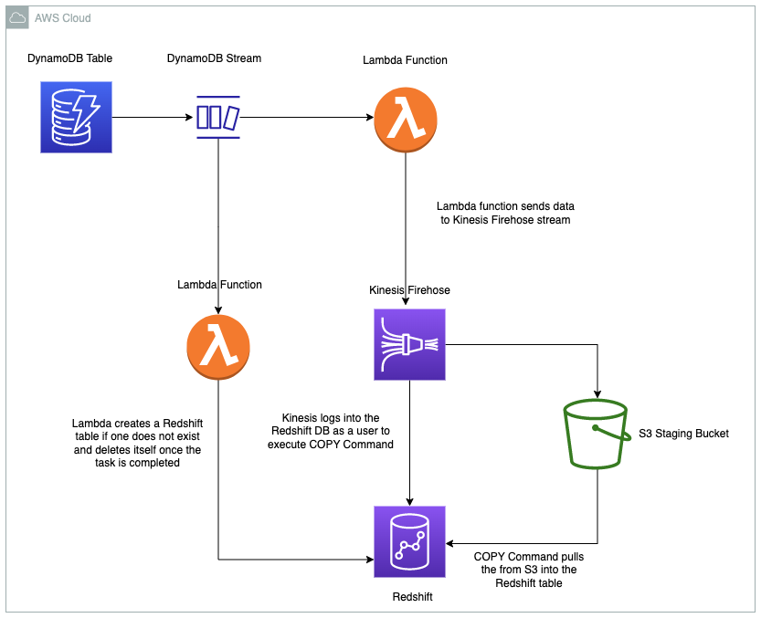

# Automated Data Processing Pipeline Using AWS CDK

## Table of Contents

1. [About](#about)
2. [Architecture](#architecture)
3. [Usage]()
4. [Acknowledgements]()

## About

The pipeline automatically processes data coming from DynamoDB table and sends data into a Redshift table. The data should be mapped accordingly to the matching columns in the destination table. The project leverages infrastructure as code (IaC) using AWS CDK to provision the necessary pipeline infrastructure.

## Architecture



## Usage

Ensure AWS CDK is installed and bootstrapped. Additionally, ensure your AWS credentials are configured.

```bash
$ npm install -g aws-cdk
$ cdk bootstrap
```

Then install dependencies and deploy.

```bash
$ npm i
$ cdk deploy --all
```

## Acknowledgements

This project is based on an article that can be found [here](https://www.linkedin.com/pulse/aws-automated-data-processing-pipeline-dynamodb-stream-v-y-reddy/). I gratefully acknowledge the author for providing the project prompt.
